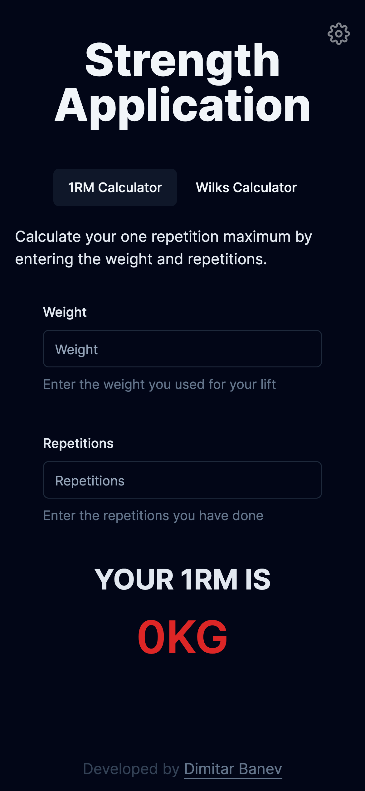

# Strength Application

Simple web application to estimate your one rep max of a gym lift based on the lifted weight and repetitions done. Also there is option to calculate your powerlifting wilks score.

[**LIVE DEMO** - https://strength-application.devastion.com/](https://strength-application.devastion.com/)

The goal is to practice NextJS and see how it works. One **MAJOR** problem I found and didn't think of is that using `redux-persist` library blocks the initial render on the server side, because it neeeds the client's localstorage to load. Since database is kinda overkill for this project I decided to persist state in the localstorage that way.

Tech Stack:

- NextJS w/ TypeScript
- Redux / Redux Toolkit / Redux Persist
- Jest w/ React Testing Library
- RadixUI (shadcn) & TailwindCSS
- Jenkins

Roadmap:

- [x] Wilks Page
- [x] Switch from AWS to VPS
- [x] CI/CD Pipeline - using VPS with jenkins container and action to trigger the pipeline. AWS is quiet expensive for my hobby projects and moved everything on my own VPS.
- [x] History

## How to start the project

1. `git pull`
2. `npm install`
3. `npx husky install`
4. You can use `npm run commit` to commit with commitizen.

